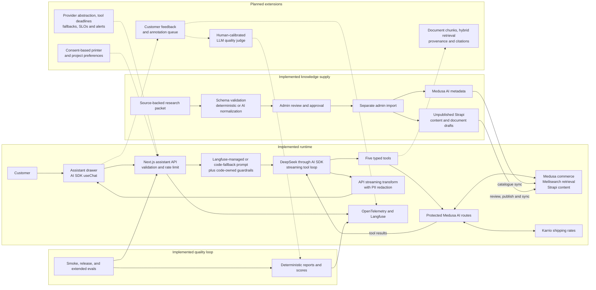

# 3D Byte Tech Store

3D Byte Tech Store is a TypeScript monorepo for a 3D-printing commerce
platform. Medusa owns commerce, Strapi owns editorial content, Meilisearch
serves discovery, and the Next.js storefront composes those services for
customers.

> The active storefront is `apps/storefront-v3`. `apps/storefront` is retained
> as reference code and is not a pnpm workspace.

## System at a glance

```text
Medusa (catalogue, carts, orders, customers) <-> Strapi (editorial content)
                  |                                  |
                  +--------> Meilisearch <------------+
                                  |
                           Next.js storefront
```

The storefront reads Medusa for transactional commerce, Strapi for managed
content, and Meilisearch for products, categories, brands, documents, blog
content, and address lookup. Shared OpenTelemetry helpers live in
`packages/observability`.

## AI Shopping Assistant

The shopping assistant is a bounded, tool-using system. The model does not
query commerce databases or mutate carts and orders directly. A Next.js route
streams the conversation, applies the prompt and safety policy, and exposes a
small set of typed tools backed by protected Medusa endpoints.

### Current and planned architecture

Solid arrows below are implemented. Dashed arrows and the **Planned** group are
future work, not claims about the current runtime.



### What is implemented

| Layer               | Current behavior                                                                                                                                                                                                                                                | Evidence                                                                                                                                                                                                 |
| ------------------- | --------------------------------------------------------------------------------------------------------------------------------------------------------------------------------------------------------------------------------------------------------------- | -------------------------------------------------------------------------------------------------------------------------------------------------------------------------------------------------------- |
| Conversation        | A responsive drawer sends browser-session context and renders AI SDK text, tool state, and product suggestions as a stream.                                                                                                                                     | [Assistant UI](apps/storefront-v3/src/features/ai-shopping-assistant/components/shopping-assistant-drawer.tsx)                                                                                           |
| Orchestration       | Zod bounds public input, an IP limiter protects the route, the agent loop is capped at five steps, and DeepSeek is called through an OpenAI-compatible AI SDK adapter.                                                                                          | [Assistant route](apps/storefront-v3/src/app/api/ai-shopping-assistant/route.ts)                                                                                                                         |
| Grounded tools      | `searchProducts`, `lookupOrder`, `getTracking`, `estimateShipping`, and `createSupportTicket` call internal Medusa routes rather than giving the model direct data access.                                                                                      | [Backend AI routes](apps/backend/src/api/ai/)                                                                                                                                                            |
| Product knowledge   | Product candidates come from Meilisearch and are hydrated with Medusa facts, Strapi content, and deterministic print-process, RC-building, compatibility, and support signals.                                                                                  | [Product guidance](apps/backend/src/api/ai/product-guidance/route.ts), [expert routing](apps/backend/src/api/ai/product-guidance/product-experts.ts)                                                     |
| Knowledge ingestion | Source-backed research packets are validated, normalized, held as drafts, and reviewed by an admin. Approved drafts can then be imported through a separate admin action into Medusa metadata and unpublished Strapi content/document drafts.                   | [Integration intake](apps/backend/src/api/integrations/hermes/product-drafts/), [draft importer](apps/backend/src/lib/ai-product-drafts/importer.ts)                                                     |
| Safety              | Commerce guidance is suggest-only. Order and tracking reads require reference-plus-email proof, support creation requires explicit confirmation, internal calls use a shared token, and visible email addresses are redacted from streamed output.              | [Code-owned guardrails](apps/storefront-v3/src/app/api/ai-shopping-assistant/prompt-management.ts), [stream sanitizer](apps/storefront-v3/src/app/api/ai-shopping-assistant/visible-output-sanitizer.ts) |
| Observability       | Traces carry session, release, model, prompt, guardrail, token-usage, and provider-cache metadata. Trace input/output is sanitized before Langfuse export.                                                                                                      | [Observability package](packages/observability/src/langfuse.ts)                                                                                                                                          |
| Evaluation          | The runner decodes real streams, captures tool evidence, supports multi-turn cases, and produces deterministic Langfuse-compatible scores across 8-case smoke, 28-case release, and 43-case extended suites. GitHub Actions applies deploy-aware staging gates. | [Eval cases](apps/storefront-v3/src/app/api/ai-shopping-assistant/evals/), [eval workflow](.github/workflows/ai-assistant-evals.yml)                                                                     |

This is currently tool-grounded retrieval over structured commerce and
editorial data, not an embedding/vector RAG system. Product documents already
have a public Meilisearch index, but assistant-side chunk retrieval, answer
citations, and hybrid ranking are still planned.

### Future implementation roadmap

| Priority                         | Planned architecture change                                                                                                                                                                                         | Acceptance signal                                                                                            |
| -------------------------------- | ------------------------------------------------------------------------------------------------------------------------------------------------------------------------------------------------------------------- | ------------------------------------------------------------------------------------------------------------ |
| 1. Grounded document retrieval   | Add a `searchKnowledge` tool over chunked product manuals, datasheets, safety documents, and source metadata; combine lexical and semantic candidates, rerank them, and return citations with every grounded claim. | Versioned retrieval set with recall-at-k, ranking, citation-validity, and unsupported-claim checks.          |
| 2. Human feedback loop           | Add optional answer feedback tied to the existing trace/session, route low scores and support handoffs to an annotation queue, and promote reviewed failures into versioned eval cases.                             | Traceable feedback-to-dataset lineage and a review queue with explicit ownership.                            |
| 3. Calibrated quality evaluation | Keep deterministic safety/tool checks as hard gates, then add an LLM judge calibrated against human labels for relevance, completeness, and recommendation quality.                                                 | Judge agreement measured against reviewed examples; model scores remain advisory until the threshold is met. |
| 4. Production reliability        | Split the large route into policy, provider, tool, and telemetry modules; add a shared rate limiter, per-tool deadlines, retry budgets, circuit breakers, provider fallback, and cost/latency/error budgets.        | Failure-injection tests plus release dashboards and alerts for quality, p95 latency, tool errors, and cost.  |
| 5. Consent-based personalization | Store explicit printer, material, and project preferences separately from protected order data, with expiry, export, and deletion controls.                                                                         | Opt-in recommendation lift without weakening privacy or order-proof requirements.                            |

Detailed eval operations and historical design decisions live in the
[AI engineer pathway](docs/ai-engineer-pathway/README.md). The README describes
the stable architecture; implementation plans remain in `docs/` until shipped.

## Active workspaces

| Workspace                | Responsibility                                 | Local endpoint                |
| ------------------------ | ---------------------------------------------- | ----------------------------- |
| `apps/backend`           | Medusa API, admin, workflows, integrations     | `http://localhost:9000`       |
| `apps/cms`               | Strapi content management                      | `http://localhost:1337/admin` |
| `apps/storefront-v3`     | Next.js customer storefront                    | `http://localhost:3001`       |
| `packages/observability` | OpenTelemetry and Langfuse helpers             | Library                       |
| `packages/shared-config` | Shared TypeScript, ESLint, and Prettier config | Library                       |
| `packages/shared-types`  | Cross-workspace contracts                      | Library                       |
| `packages/shared-utils`  | Shared utilities                               | Library                       |

Exact framework versions are pinned in each workspace's `package.json`. Those
manifests are the source of truth; do not duplicate version pins in guides.

Current runtime integrations include Stripe payments, Karrio shipping,
Cloudflare R2 media storage, Resend/MailDev email, Google customer OAuth, an AI
shopping assistant, and OpenTelemetry/Langfuse tracing.

## Prerequisites

- Node.js `22.22.1` (see `.node-version` and `.nvmrc`)
- Corepack with pnpm `10.32.1` (pinned in the root `package.json`)
- Docker with Compose for the recommended hybrid development command
- PostgreSQL reachable from Medusa and the local Karrio containers; Strapi may
  use its default local SQLite database or an explicitly configured PostgreSQL
  database

## Local setup

```bash
git clone https://github.com/kkurtzhang/3dbyte-tech-store.git
cd 3dbyte-tech-store

corepack enable
corepack prepare pnpm@10.32.1 --activate
pnpm install --frozen-lockfile

cp apps/backend/.env.template apps/backend/.env
cp apps/cms/.env.example apps/cms/.env
cp apps/storefront-v3/.env.example apps/storefront-v3/.env
```

Fill in Medusa's database URL, service keys, and shared secrets before starting
the apps. Configure Strapi's database variables if you do not want its default
local SQLite database. In particular, `INTERNAL_API_TOKEN` must match between
the backend and storefront. Never commit a populated `.env` file.

The Docker support stack expects a Karrio database at
`host.docker.internal:5432` with database `karrio`, user `postgres`, and
password `password` by default. Create that database or override
`KARRIO_DATABASE_NAME`, `KARRIO_DATABASE_USERNAME`,
`KARRIO_DATABASE_PASSWORD`, `KARRIO_DATABASE_HOST`, and
`KARRIO_DATABASE_PORT` in an ignored root `.env` file.

Start the hybrid development stack:

```bash
pnpm dev
```

This runs the CMS and supporting Redis, Meilisearch, and Karrio services in
Docker, while Medusa and the active storefront run through Turborepo on the
host. The local support compose file is `docker/docker-compose.yml`; the root
`docker-compose.yml` is the Coolify release stack and is not the default local
development path.

Run one application when the rest of the stack is already available:

```bash
pnpm run dev:backend
pnpm run dev:cms
pnpm run dev:storefront
```

Useful local endpoints:

| Service          | URL                           |
| ---------------- | ----------------------------- |
| Storefront       | `http://localhost:3001`       |
| Medusa API       | `http://localhost:9000`       |
| Medusa Admin     | `http://localhost:9000/app`   |
| Strapi Admin     | `http://localhost:1337/admin` |
| Meilisearch      | `http://localhost:7700`       |
| Karrio API       | `http://localhost:5002`       |
| Karrio dashboard | `http://localhost:3002`       |

## Common commands

```bash
# Build, lint, type-check, or test every workspace that defines the task
pnpm build
pnpm lint
pnpm type-check
pnpm test

# Active storefront
pnpm --filter=@3dbyte-tech-store/storefront-v3 build
pnpm --filter=@3dbyte-tech-store/storefront-v3 lint
pnpm --filter=@3dbyte-tech-store/storefront-v3 test
pnpm --filter=@3dbyte-tech-store/storefront-v3 test:coverage

# Backend
pnpm --filter=@3dbyte-tech-store/backend build
pnpm --filter=@3dbyte-tech-store/backend test:unit
pnpm --filter=@3dbyte-tech-store/backend test:integration:http
pnpm --filter=@3dbyte-tech-store/backend test:integration:modules

# CMS
pnpm --filter=@3dbyte-tech-store/cms build

# Browser tests
pnpm exec playwright test
```

`pnpm test` only runs workspaces with a generic `test` task; backend suites are
separate and must be invoked explicitly. The CMS currently has no standard
automated test script, so CMS changes require a build plus focused manual or API
verification.

When changing a shared package, keep internal dependencies on `workspace:*` and
build the affected consumers.

## Environment contracts

Use the tracked examples as checklists instead of copying environment variable
lists into new documentation:

- Local backend: `apps/backend/.env.template`
- Local CMS: `apps/cms/.env.example`
- Local storefront: `apps/storefront-v3/.env.example`
- Staging: `deploy/environments/staging.env.example`
- Production: `deploy/environments/production.env.example`
- Shared search: `deploy/search/search.env.example`

The root `.env.example` documents the Coolify/OCI release compose contract. It
is not a drop-in local application environment file.

## Deployment

Deployments use Coolify on OCI with the root `docker-compose.yml`:

- `staging` is the staging release branch.
- `main` is the production release branch.
- Meilisearch runs as a separate shared Coolify resource.
- Documentation-only and workflow-only changes should not trigger a runtime
  rebuild; keep Coolify watch paths aligned with the runtime inputs documented
  in the deploy runbook.

Read these before changing deployment behavior:

- [Environment policy](deploy/environments/README.md)
- [Coolify scoped deploys and watch paths](deploy/coolify/README.md)
- [Shared Meilisearch resource](deploy/search/README.md)
- [Development-stage architecture](docs/dev-stage-architecture.md)

## Project documentation

- [Agent and contributor instructions](AGENTS.md)
- [AI engineer pathway](docs/ai-engineer-pathway/README.md)
- [Meilisearch integration guide](docs/meilisearch-integration-guide.md)
- [Observability and tracing](docs/observability-tracing.md)
- [Customer authentication manual test](docs/runbooks/customer-auth-manual-test.md)
- [CMS documentation](apps/cms/docs/)

Historical plans and reports are evidence of past decisions, not current
runtime documentation. Verify their claims against the active manifests and
code before reusing them.

## Contribution workflow

1. Start from the target branch and use an isolated worktree for substantial
   changes.
2. Read [AGENTS.md](AGENTS.md) and the `CLAUDE.md` inside each active app you
   will modify.
3. Add regression coverage before implementation when a test harness exists.
4. Run the smallest relevant test set, then the broader build/lint/type-check
   gates for affected workspaces.
5. Review the full diff for secrets and unrelated changes.
6. Use conventional commits such as `fix(storefront): ...` or
   `docs(backend): ...`.

Operational claims are not considered verified until the relevant boundary is
checked. For staging issues, that usually means the deployed commit, service
health, logs, backing data, and the browser or API behavior—not a local build
alone.
